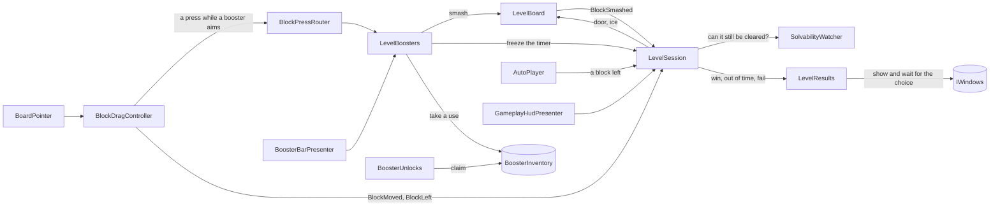

# Color Block Jam — Vertical Slice

A vertical slice of Color Block Jam made in Unity 2022.3.62f2 (URP), for 1080×1920 portrait screens.

Drag colored blocks around the board and slide each one out through a door of its own color before the timer runs out.

## How to run

1. Open the project with **Unity 2022.3.62f2**. Packages resolve from `Packages/manifest.json`: URP 14, Input System, UniTask, LitMotion, VContainer and TextMesh Pro.
2. Open `Assets/ColorBlockJam/Scenes/Splash.unity` and press **Play**. Set the Game view to a portrait resolution, such as 1080×1920 or 1080×2400.
3. To build an APK, switch to Android in *File › Build Settings* and press **Build**. The build settings already list the scenes (Splash, Main, Gameplay), and the player settings use IL2CPP and ARM64.
4. To run the tests, open *Window › General › Test Runner*. There are 86 EditMode tests and 3 PlayMode tests for the component pool. Among other things, they cover the board rules, the drag movement (sliding, rolling around corners, never overlapping, no allocations per frame), picking the nearest block within the margin, arrow blocks, ice and holes, the solver, the timer, its freeze and the time added to it, the wallet, the booster inventory and unlocks, the booster targets, which obstacles a level introduces, the generator, and checks that every level and every booster that ships is sound, that each level earns its difficulty badge, and that the levels get harder over time.

To reset progress, coins, boosters and the obstacles seen, use *Edit › Clear All PlayerPrefs*. The keys are `progression.currentLevel`, `economy.coins`, `boosters.<id>.unlocked` and `boosters.<id>.count` for each booster, and `obstacles.<id>.seen` for each obstacle.

### How to play

- Drag a block with the mouse or a finger. The block slides until it meets something. If you push it past a corner, it rounds the bevel on a curve.
- A press does not have to land exactly on a block. A press on an empty cell takes the nearest block within a margin around it (`pickPadding` on `GameplayConfig`, 0.3 of a cell), so a small block, or one at the edge of the board, is easy to grab. Boosters aim the same way.
- A block leaves the board when you push it into a door of its own color, but only if its whole shape fits through that door. Dropping it right in front of such a door is enough: it goes in by itself.
- **Arrow blocks** carry a double arrow and move only along it. They can only leave through a door ahead of them.
- Some boards have **holes**: cells taken out of the board, with a wall around them. Blocks go around them like around the outer wall.
- **Frozen blocks** sit in ice showing a number: how many more blocks must leave before the ice breaks. Until then they cannot move, and pulling them only makes them shake.
- Clear the board before the timer reaches zero. **Level Complete** shows the coins you won, and **Continue** opens the next level.
- When the timer reaches zero, **Out of Time!** offers 20 more seconds for 100 coins (both are set on `GameplayConfig`). **Continue** buys them and the level goes on. With fewer coins the price turns red and the button does nothing. ✕ or the back button gives up.
- The level fails in two cases, and **Level Failed** offers **Retry** and **Home**:
  - **Time's up**: the timer reached zero and no time was bought.
  - **No moves left**: the board can no longer be cleared.
- On **Out of Time!** and **Level Failed**, press and hold anywhere outside the panel to see the board.
- The HUD has these buttons:
  - **Restart** starts the level again.
  - **Pause** opens the settings with a **HOME** button that leaves the level; close them to play on. The level also pauses on the Android back button and, on a device, when the app loses focus. In the editor, clicking outside the Game view does not pause it.
  - **AUTO** lets the solver play the level from where you are.
- In the editor and in development builds, → and ← jump to the next and the previous level, to try levels quickly.
- The first level that has arrow blocks, ice or holes opens with a popup that introduces each of them; **Continue** starts the level. An obstacle is introduced only once.
- Boosters unlock as you play. At the start of the level a booster unlocks at, a popup presents it; press **Claim** and it rises into the bar under the board. Until then it is not shown.
  - **Freeze** (level 2) stops the timer for 10 seconds; the timer turns icy while it holds.
  - **Hammer** (level 4): tap it, then tap any block, frozen or not, to break it.
  - **Rocket** (level 6): tap it, then tap a block to clear every block in its row.
  - **Vacuum** (level 8): tap it, then tap a block to remove every block of its color.
- Each booster comes with a few uses, counted on its badge. With none left, a use is bought with coins (100 to start, and 10, 20, 30 or 50 for each level by its badge, set on `EconomyConfig`), and its price shows instead. A booster that aims at a block is paid only when it hits one, so tapping it again to put it back is free.

## Level editor

You can open it in three ways:

- the menu **Color Block Jam › Level Editor**,
- double-click a level file (`Systems/Level/Data/Levels/LevelNNN.json`),
- the **Open Level Editor** button on `LevelCatalog.asset`.

The window has three columns:

| Left | Center | Right |
|---|---|---|
| The levels of the catalog, in play order. Click one to load it. ▲ ▼ reorder, **Remove** takes a level out of the catalog (the file stays). | The board. The ring around it is the wall, and doors are drawn on it. | Board settings, tools, colors, the selected block, checks and the generator. |

**Making a level**

1. Press **New**, or pick a level on the left.
2. Set **Width**, **Height**, **Time** and **Difficulty**.
3. Pick a **color**, then a **tool**:
   - **Draw**: drag over empty cells. One drag makes one block of any shape.
   - **Stamp**: pick a shape, then click a cell.
   - **Door**: click or drag along the wall. Clicking a door of the chosen color removes it.
   - **Move**: drag a block somewhere else. It turns red where it does not fit.
   - **Erase**: click a block, a door or a removed cell.
   - **Hole**: click or drag over empty cells to take them out of the board, and again to put them back. In the game a removed cell is a hole with a wall around it.

   Right-click erases with every tool. Keys 1–0 pick a color, ← → open the previous and next level of the catalog, Delete removes the selected block, and Ctrl+Z / Ctrl+Y undo and redo.
4. Click a block to select it. **Moves** makes it an arrow block (Horizontal or Vertical), and **Ice** freezes it until that many other blocks have left. The board draws the arrow and the ice count where the game puts them.
5. **Check** lists mistakes right away: a color without a door, a block that fits no door it can reach (for an arrow block, only the doors ahead of it count), ice that can never melt, overlaps, a block on a removed cell, a door that opens onto one, a hole smaller than 2×2. It then runs the solver in the background. It tells you whether the level is solvable, in how many moves, and which difficulty it plays like. You can step through the solution on the board with ◀ ▶, ice counting down included.
6. **Generate** makes a new solvable level of the chosen difficulty. Medium and harder levels may get arrow blocks, and hard and super hard levels blocks in ice. **Holes** adds up to two holes inside the board. The same seed always gives the same level.
7. **Save** writes over the level's file. **Save As New Level** adds a file at the end of the catalog. Before saving a level that has problems or has not been checked, the editor warns you.
8. **▶ Play** starts the gameplay scene with this level, without touching the player's progress.

**Format.** The editor and the game read the same JSON file (`LevelData`). `axis` is 0 free, 1 horizontal, 2 vertical; `ice` is how many blocks must leave first; `holes` are the removed cells:

```json
{ "width": 6, "height": 7, "timeLimit": 95, "difficulty": 1,
  "blocks": [ { "color": 3, "x": 1, "y": 2, "cells": [ {"x":0,"y":0}, {"x":1,"y":0} ], "axis": 1, "ice": 0 } ],
  "doors":  [ { "side": 0, "start": 2, "length": 2, "color": 3 } ],
  "holes":  [ {"x":2,"y":3}, {"x":3,"y":3} ] }
```

Colors are indexes into `BlockPalette.asset`, which has 10 colors. `LevelCatalog.asset` lists the level files in play order; after the last level, the game starts again from the first.

**The 50 levels that ship with the game**

- **Difficulty is the number of moves it takes to win**: every block has to be sent out once, plus every block the best solution has to move out of the way first (`LevelRating`). The badge follows from it: up to 8 moves is **Easy**, up to 12 **Medium**, up to 16 **Hard**, and more is **Super Hard**. The level check in the editor suggests the badge the same way, and a test makes sure every level wears the badge its moves earn.
- **Levels 1–3 are tutorials**, made by hand: one block to send out, then two, then three where one has to go first to clear the way. Each needs only straight moves, ready for a guided hand.
- **The badges follow a curve with tension and release.** The first 30 go *e e e e e e m e e e h m m m sh e m m m m m m m e m h m m m sh*, then the next 15 end on a super hard one again, hard levels come more often as the game goes on, and an easy level follows each peak.
- **Each badge also gets harder over the 50 levels**: more moves within its range, more blocks and colors, bigger boards. Arrow blocks join at level 12, ice at level 22 and holes at level 16, each on a level where it is the only new thing. After that, about every third level has a hole of at least 2×2 cells.
- Level 26 is the level reworked by hand in the editor earlier, now a hard one.
- The other levels come from the editor's generator with settings for each level, and each was kept only when every check passed, the in-game solver cleared it within the budget it checks for being stuck, and its moves matched its badge.

## Architecture

### One project, one folder per system

The whole game is one project in `Assets/ColorBlockJam`. Each system has a folder under `Systems/`, and that folder holds everything the system owns:

| System | What it owns |
|---|---|
| Core | installers and scopes, scene loading and the scene names, key-value storage, startup tasks |
| Boot | the root scope and VContainer's settings, the app settings, the splash screen and its loading bar |
| UI | views and presenters, the window catalog, service and layer, buttons with feedback, transitions, the safe area, and the shared widgets (close button, slide switch) |
| Navigation | the tab bar and its pages |
| Settings | the settings service, haptics and the settings popup |
| Pooling | the component pool |
| Economy | coins and the coin counter |
| Progression | the current level |
| Level | the level format, the block palette, and the catalog with the 50 levels |
| Gameplay | the rules (`Logic`), the board and its input, the session, the HUD and the popups of a level |
| Boosters | the booster definitions, the inventory, the bar and the unlock popup |
| Obstacles | the obstacle definitions and the popup that introduces a new obstacle |
| Home | the home screen and its level path |
| LevelEditor | the level editor window |
| Rendering | the render pipeline and the shaders |

- A system's folder has `Scripts` with its assembly, `Data` with its assets, `Prefabs`, and `Logic` or `Editor` where it has them. The installer asset that registers a system's app-wide services sits in that system's `Data`. A system is read, changed or removed in one place.
- Every system is an assembly, and references go one way. The general systems (Core, UI, Navigation, Settings, Pooling) know nothing of the game's rules, and `Gameplay.Logic` and `Level.Data` do not reference Unity at all. *Why:* each system compiles and is tested on its own, and the compiler keeps the dependencies honest.
- `Art` and `Scenes` hold the shared art and the three scenes. `Tests/EditMode/<System>/` and `Tests/PlayMode/<System>/` hold the tests, grouped by the system they cover.
- Every type has a file named after it. The code has no comments: names carry the meaning, every inspector setting explains itself in a tooltip (in Turkish), and this README holds the design.

### Composition with VContainer

- The **root scope** (`Systems/Boot/Prefabs/AppScope.prefab`) runs the `ScriptableInstaller` assets of the systems with app-wide services: storage and scene loading (Core), the app settings (Boot), the settings, the economy, the progression, the booster inventory and the windows.
- Each **scene scope** runs `MonoInstaller` components for that scene's services.
- In the gameplay scene, **each level has its own child scope**. The scene scope keeps what outlives a level: the camera, the board view, the burst pool, input, the HUD and bar views, the level flow. `LevelRunner` builds a child scope for the level from the `LevelInstaller`, `LevelBoostersInstaller` and `LevelObstaclesInstaller` assets that `LevelScopeInstaller` lists: the session, the board, the solver watch, the results, the drag, pause, the HUD presenter, the boosters and the obstacle introductions. Restart and Next dispose that scope and build a new one, without loading the scene again. Disposing the scope cleans up everything the level made: block views, the board mesh, bar buttons and every pending search, timer or window.
- *Why:* systems are added or removed in the Inspector, there are no singletons or static state, and a scene's objects live exactly as long as the scene.

### UI

- The UI uses **MVP**. A passive `UIView` shows data and raises events; a plain C# `ViewPresenter<TView>` holds the logic.
- How things look is a **strategy asset**:
  - `ViewTransition`: fade, scale,
  - `ButtonFeedback`: scale, punch, jelly, wiggle, tilt, heartbeat, pop,
  - `ToggleStateVisual`: objects, color, slide.
- Buttons derive from `ButtonBase` and only decide what a click does. A button that is switched off dims itself.
- **Windows** (the popups) live in the root scope, in one `WindowLayer` that stays across scenes. Each system lists its own windows in its own `WindowCatalog` (`SettingsWindows`, `GameplayWindows`, `BoosterWindows`, `ObstacleWindows`): for each, a presenter picked from a list, the prefab it shows, and how it behaves (dims the background, closes on a backdrop tap, on the back button or when the scene changes, is destroyed when hidden, its show and hide transitions). `WindowInstaller` in `Boot/Data`, the composition root, installs every catalog, so the UI system itself names no gameplay type, not even in its data. The prefab only holds its view's references and settings of its own, such as a message format or colors.
- A presenter states its view and the type of answer it gives (`WindowPresenter<TView, TResult>`), so a window can only finish with an answer of that type.
- A window works like a function. `windows.Get<OutOfTimePopupPresenter>().ShowAsync(offer)` shows it with its data and returns the player's choice: whether time was bought, Retry or Home, Home from the pause menu. The code that opened it acts on the answer, so presenters depend only on app services (the wallet, the settings) and know nothing of a level. A window closed by a scene change cancels its pending call, so the old scene's code never runs on.
- In a level, pause shows `GameplaySettingsPopup`, a prefab variant of the home `SettingsPopup` with a HOME button, through `PauseMenuPresenter`. A `WindowPeekArea` fades the whole window layer while it is held, so any window can let the player look behind it.
- The popups follow the reference screens of the original game, with the supplied sprites. Their 9-slice scale (*Pixels Per Unit Multiplier*) is set so that each frame's corners match the references.
- *Why:* designers can change feel and layout without code, and the presenters can be tested without a scene.

### Gameplay layers

| Layer | Where | What |
|---|---|---|
| Data | `Systems/Level` (`Level.Data` has `noEngineReferences`) | `LevelData` (JSON), `BlockPalette`, `LevelCatalog`. One format for the editor and the game. |
| Rules | `Systems/Gameplay/Logic` (`noEngineReferences`) | `Board`, `BoardBlock`, `BlockDragMover`, `BlockPlacement`, `BoardSolver`, `LevelGenerator`, `LevelDiagnostics`, `LevelTimer`, `BlockMarks` |
| View and input | `Systems/Gameplay/Scripts/Board`, `Input` | `BoardView`, `DoorView`, `BlockView`, `BlockMeshBuilder`, `BlockDragController` (Input System), `BoardCamera`, `BlockBurstEffects` |
| Flow | `Systems/Gameplay/Scripts/Session` | `LevelSession` (timer, extra time, win and fail), `LevelBoard` (builds and shows the board), `SolvabilityWatcher`, `LevelResults`, `PauseRequester`, `AutoPlayer`, `LevelFlow`, `LevelProvider` |
| Boosters | `Systems/Boosters` (its own assembly) | the booster definitions and catalog, `BoosterInventory`, `LevelBoosters`, `BoosterUnlocks`, the bar and the unlock popup |
| UI | `Systems/Gameplay/Scripts/Hud`, `Popups` | HUD, and the out-of-time, fail and complete popups |

*Why:* the rules know nothing about Unity. The game, the level editor, the tests and worker threads all use the same code.

How a move flows through the gameplay scene:



Every way a block leaves the board, through a door, by auto play or under a booster, ends in one method of `LevelSession`, so the door animation, the ice, the win check and the stuck check follow each of them the same way.

### Movement

Movement is fully algorithmic, with no physics engine, but it behaves like pushing a real object across a table:

- **The finger only sets a target.** Every frame the block catches up with it like a weight on a spring: fast when far, gently when close, never faster than a speed cap. It keeps catching up while the finger rests, so a quick flick is never left halfway.
- **Each step is swept** (`BlockDragMover`). The whole path of the frame is tested at once and stops at the first contact, so a fast drag never passes through anything.
- **The rest of the step slides along what it touched.** The part pushing into the surface is dropped and the rest is swept again, several times per frame. That is how the block rubs along walls and other blocks instead of stopping.
- **Corners are round, sides are flat.** The collision works on the block's position: every cell offset where the block would not fit is an obstacle shaped as a 2×2 square with rounded corners. Neighboring obstacles overlap by a whole cell, so flat sides have no seams to snag on, and only real corners are round. Pushed into a corner, the block rolls around it on a curve; pushed at a gap it is slightly out of line with, it is guided in.
- **Blocks never overlap.** The view sits exactly where the mover puts the block, with no smoothing that could cut a corner. Only half a percent of a cell of play is kept, too small to see, so a block always fits a gap exactly its own size.
- On release the block settles on the nearest free cell with an ease that does not overshoot into its neighbor.

### Pivots

Every object the board builds has a parent whose pivot is where it stands on the floor, at y = 0 for all of them: a block (`BlockView`, its mesh on the `Body` child and its ice on a `BlockIce` child), a door (`DoorView`, its mesh on the `Mesh` child) and the board parts (the ground and walls, and the floor). So a block lifts, shrinks and is smashed from its base, and a door squashes down into the floor. Walls and doors reach below the floor (`wallHeightOffset` on `BoardArt`); that part stays under their pivot.

### Doors

- A block leaves when `Board.CanPassThrough` holds: every cell the whole shape sweeps on the way out is free or beyond a door of its color. An L-shaped block therefore cannot leave through a door that only its foot fits.
- A block dropped on a cell right in front of a door it can pass through goes in by itself (`BlockPlacement.DoorToEnter`).
- Doors of one color side by side are one stretched piece, and each squashes and springs back as a block goes through it.
- The middle of each door carries the supplied `Door_Arrow`, pointing out of the board, the way a block leaves. It is part of the door's mesh, so it squashes with the door, and it takes a light shade of the door's color, like the arrows on blocks.

### Holes

- A level lists the cells taken out of its board. Every hole is at least 2×2 cells, which the level checks enforce. The generator keeps holes off the edges and apart from each other, so no door opens onto one. `Board` treats them like walls: no block can be placed on one, slide into one or pass through one. The drag, the solver, the stuck check and the level checks all follow from that without knowing about holes.
- `BoardView` lays no ground tile on a hole and builds its rim from the supplied wall and corner models. A wall runs inside the hole along every side that faces the board, a corner piece rounds each outer corner, and another fills the notch where a hole turns inward. The background shows through the middle, as in the original game.

### Arrow blocks and ice

- **Arrow blocks.** `BoardBlock.MovesAlong` limits a block to its axis. The drag mover drops the part of every step across the axis, settling stays on the block's row or column, `CanPassThrough` refuses doors off the axis, and the solver only reaches cells along it. The level check makes sure a door of its color is ahead of it.
- **Ice** is stored as how many blocks must leave first, and the frozen state is derived: a block is frozen while fewer blocks have left than its ice. So there is no ice state to update, reset or undo; the solver gets it for free, because the blocks that have left are already part of each state it explores.
- `BlockMarks` decides where the arrow and the ice count go on a block. The game and the level editor both use it, so they always agree.
- The arrow is part of the block's mesh, in a light shade of the block's color. The ice is the block's own mesh pushed out a little and drawn see-through with its own small shader (a projected frost texture, a rim and a glint). The count is a 3D text over it. Both are in the `BlockIce` prefab, which a block creates only when it has ice and which removes itself when the ice breaks.

### Obstacle introductions

- **Each obstacle is an asset.** An `ObstacleDefinition` holds its id, its name, its description and an optional icon, and each kind of obstacle is a small subclass that says whether a level has it (`ArrowBlockObstacle`, `IceObstacle`, `HoleObstacle`). `ObstacleCatalog` lists them in the order their popups show. A new obstacle takes a subclass, an asset and a catalog entry.
- **The level decides, not a level number.** At the start of a level, `ObstacleIntros` asks `ObstacleRules` which obstacles the level's data has and which of them the player has not seen (`SeenObstacles`, saved), and shows `ObstacleIntroPopup` for each. An obstacle counts as seen once **Continue** closes its popup.
- **One queue for the popups of a level's start.** `LevelIntros` runs every `ILevelIntro` of the level scope one after another, the booster unlocks first and then the obstacles, so two of them never open on top of each other, and levels tried from the editor show none. A new kind of level-start popup only registers another `ILevelIntro`.
- The booster unlock and obstacle popups share one view and prefab in UI, `ShowcasePopup` (an icon, a name, a description and one button), and one presenter base, `ShowcasePopupPresenter`. `BoosterUnlockPopup` and `ObstacleIntroPopup` are prefab variants that change only the title and the button text. No obstacle icons were supplied, so the icon is hidden until one is set on the asset.

### Boosters

- **Each booster is an asset.** A `BoosterDefinition` holds its id, name, description, icon, unlock level, starting count and coin price, and creates its own effect. `BoosterCatalog` lists the boosters in bar order.
- **Effects are small classes.** An `InstantBoosterEffect` runs at once; the freeze holds `LevelTimer` while the level goes on. An `AimedBoosterEffect` waits for the player to pick a block: the hammer breaks it, the rocket clears its row, the vacuum its color. The blocks they take come from `BoardTargets`, in the rules.
- **No booster has input code, and the gameplay code does not know boosters exist.** While one aims, the drag controller hands the pressed block and cell to the `BlockPressRouter`, and `LevelBoosters` is on it. Without the Boosters system, the gameplay scene runs just the same.
- **The player's boosters are saved** by `BoosterInventory`, registered for the whole app. A use takes an owned booster first and buys one with coins only when none are left; an aimed booster is paid only when it hits.
- **Unlocking.** At the start of a level, `BoosterUnlocks` finds the boosters the level has reached but the player has not claimed, so an old save catches up too, and shows `BoosterUnlockPopup` for each. The booster opens on **Claim**: the popup closes and the button rises into the bar with `ScaleUpTransition`. Locked boosters are not shown, and levels tried from the editor unlock nothing.
- **Adding a booster** takes a definition class that returns its effect, the effect class, an asset made from the definition's *Create* menu, and an entry in `BoosterCatalog`. The bar, the inventory, the unlock popup and the catalog test pick it up from there.

### Solver and stuck

- Leaving never hurts, because it only frees space. So the solver first lets every block that can reach its door leave, and keeps going round while leaving blocks thaw others.
- It then searches, breadth first, over *repositions*: moving one block to any cell it can reach. The depth of the result is the number of blocks that must be moved out of the way, which is the level's difficulty.
- Every move can be undone and leaving never hurts, so **a solvable board stays solvable whatever the player does**.
- The session therefore asks the solver on a worker thread, on a copy of the board, and asks again only while the answer is unknown. The search can be cancelled, so leaving the scene never leaves it running. The stuck fail popup appears after the player's first move on a level that cannot be cleared.

### Generator

The generator places random doors and blocks for a difficulty, turns some blocks into arrow blocks and freezes some in ice, and drops any layout where a block can never fit a door of its color. It keeps the first layout the solver proves solvable with a number of repositions in that difficulty's range. Generation is seeded, so it can be repeated.

### Performance

- Each block is merged into **one mesh**, arrow included. The board (ground tiles, walls and corners) is **one mesh** too, with a submesh for the ground and one for the walls; only the colored doors are meshes of their own. Under the ground tiles lies a flat **floor**, a mesh built in code with its own material (`Floor.mat`). It covers only the board's cells, one quad for each run of cells in a row, leaves the holes open and casts no shadow. Along each side, every run of wall and every run of door cells of one color, even several doors side by side, is a single piece stretched to fit, so a level draws in a handful of calls.
- Blocks and doors carry their color in their vertices, written once when their mesh is built. So all blocks share one material and all doors another, no material is copied per color, no property block is needed, and the SRP Batcher (turned on in the URP asset) draws them cheaply.
- The board mesh never moves. It is already a single mesh, so it is not static batched: that would only duplicate it in memory.
- There are no allocations in the drag loop, and a test checks it. The timer text uses `SetText` with arguments and only changes once a second.
- The block bursts come from a pool and take the block's color.
- The held block's outline is only its outer rim, drawn on top of everything. Two tiny unlit shaders (`Systems/Rendering/Shaders`) do it, with no lighting, textures or keywords: one marks the block's silhouette in the stencil buffer, the other draws the mesh pushed out along its normals only outside that mark, ignoring depth. They are added as extra materials only while the block is held, and the push follows normals averaged at build time, so hard edges do not split the rim.
- The solver runs off the main thread.
- UI graphics have raycast target, maskable, rich text, kerning and extra padding turned off wherever they are not needed. UI sprites under `Art/UI/Atlas` share one sprite atlas; the large backgrounds under `Art/UI/NoAtlas` stay out of it, so they do not waste atlas space. The thin tab separator (`bg_home_line`) stays in the atlas because it is drawn between tab icons. The ice texture is capped at 512 pixels.

### Look

Everything in the gameplay scene uses one toon shader (`Systems/Rendering/Shaders/Toon.shader`), except the ice. Light falls in two soft bands, so shadow sides take a tinted color instead of going dark, and a small glint and a soft rim make surfaces read like candy. It uses only the main light and its shadows, no textures, and one material buffer for all its passes, which keeps it cheap on mobile and friendly to the SRP Batcher. The block colors are sweet tones with no white (Cherry, Tangerine, Lemon, Lime, Mint, Aqua, Sky, Grape, Bubblegum, Cocoa), on lavender walls, a periwinkle ground and background, and a plum outline for the held block.

### Persistence

Coins, the current level, the settings and the player's boosters go through `IKeyValueStorage`, which uses PlayerPrefs.

## Known issues and limits

- The APK (about 25 MB) is built into `Builds/`, which is not in the repository.
- UI sprites are imported uncompressed (RGBA32) on Android, for the sharpest look. The full-screen backgrounds cost about 25 MB of memory that way; ASTC would cut that to a fraction if memory ever matters more.
- Lives are a placeholder, as the case allows: failing a level costs nothing.
- A booster's description is plain text in its asset, so changing, for example, the freeze's seconds means changing its description too.
- On the levels that ship with the game, **stuck cannot happen**, because they are all proven solvable and solvability never changes during play. To see the stuck popup, make a level in the editor that cannot be solved (for example a block with no door of its color), then press ▶ Play.
- While AUTO plays, the timer, the boosters and the restart and pause buttons are off.
- The solver has a budget. On a very large custom level, Check may answer "no solution found within the budget" instead of a clear yes or no.
- During an editor ▶ Play, **Continue**, **Retry**, **Restart** and **Home › Play** all return to the tested level until play mode ends.
- After level 50 the catalog starts again from level 1, while the home screen keeps counting up.

**Feedback on the supplied assets**

- There was no "toggle off" sprite; `btn_toggle_off.png` was added.
- `BlockParts.fbx` and `Arrows.fbx` are modeled on the XY plane facing −Z, while `WallAndDoor.fbx` and `GroundGrid.fbx` are Y-up. The wall, corner and door models in `WallAndDoor.fbx` are also upside down, and the wall is turned a quarter; the board sets each right with its *Model turns* on `BoardArt`.
- A board cell is 2 units, and block modules are quarter cells.
- `WallAndDoor.fbx` references a missing embedded texture, and `corner_4` has an unused blend shape.
- Booster icons are 1024×1024 and the ice texture 2048×2048, much bigger than their size on screen.
- Soft shadows and glows make automatic 9-slice borders unreliable, so the borders were set by hand.
- The reference screens also show a yellow Watch Ad button with an ad icon, a coin pile with light rays and a fail offer bundle. None of these were supplied, so they are left out.

## LLM tools used

**Claude Code** (Anthropic, Claude Opus 5.5 model) was used as a pair programmer throughout. It proposed the architecture, wrote most of the C# code, the shaders and the editor tooling, inspected the supplied models, wrote the tests and the commit messages, and drafted this README. Every step was directed and reviewed by me.

## Work time

Going by the commit history, about 19 hours in six evening sessions, from 28 Sep 2026 20:10 to 3 Oct 2026 23:30.
