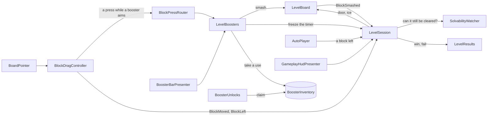

# Color Block Jam — Vertical Slice

A vertical slice of Color Block Jam made in Unity 2022.3.62f2 (URP), for 1080×1920 portrait screens.

Drag colored blocks around the board and slide each one out through a door of its own color before the timer runs out.

## How to run

1. Open the project with **Unity 2022.3.62f2**. Packages resolve from `Packages/manifest.json`: URP 14, Input System, UniTask, LitMotion, VContainer and TextMesh Pro.
2. Open `Assets/ColorBlockJam/Scenes/Splash.unity` and press **Play**. Set the Game view to a portrait resolution, such as 1080×1920 or 1080×2400.
3. To build an APK, use **Tools › Build › Android APK**. It builds the scenes of the build settings (Splash, Main, Gameplay) with the player settings as they are (IL2CPP, ARM64) into `Builds/Android/ColorBlockJam.apk`. The same build runs from the command line:
   ```
   Unity -batchmode -quit -buildTarget Android -projectPath . -executeMethod Framework.Build.AndroidBuild.BuildFromCommandLine
   ```
4. To run the tests, open *Window › General › Test Runner › EditMode*. There are 56 tests. Among other things, they cover the board rules, the drag movement (sliding, rolling around corners, never overlapping, no allocations per frame), arrow blocks and ice, the solver, the timer and its freeze, the wallet, the booster inventory and unlocks, the booster targets, the generator, and checks that every level and every booster that ships is sound.

To reset progress, coins and boosters, use *Edit › Clear All PlayerPrefs*. The keys are `progression.currentLevel`, `economy.coins`, and `boosters.<id>.unlocked` and `boosters.<id>.count` for each booster.

### How to play

- Drag a block with the mouse or a finger. The block slides until it meets something. If you push it past a corner, it rounds the bevel on a curve.
- A block leaves the board when you push it into a door of its own color, but only if its whole shape fits through that door. Dropping it right in front of such a door is enough: it goes in by itself.
- **Arrow blocks** carry a double arrow and move only along it. They can only leave through a door ahead of them.
- **Frozen blocks** sit in ice showing a number: how many more blocks must leave before the ice breaks. Until then they cannot move, and pulling them only makes them shake.
- Clear the board before the timer reaches zero. You win coins and move on to the next level.
- The level fails in two cases:
  - **Time's up**: the timer reaches zero.
  - **No moves left**: the board can no longer be cleared.
- The HUD has these buttons:
  - **Pause** opens Resume, Restart and Home. The level also pauses when the app loses focus and on the Android back button.
  - **AUTO** lets the solver play the level from where you are.
- Boosters unlock as you play. At the start of the level a booster unlocks at, a popup presents it; press **Claim** and it rises into the bar under the board. Until then it is not shown.
  - **Freeze** (level 2) stops the timer for 10 seconds; the timer turns icy while it holds.
  - **Hammer** (level 3): tap it, then tap any block, frozen or not, to break it.
  - **Rocket** (level 4): tap it, then tap a block to clear every block in its row.
  - **Vacuum** (level 6): tap it, then tap a block to remove every block of its color.
- Each booster comes with a few uses, counted on its badge. With none left, a use is bought with coins (100 to start, 10 for each level), and its price shows instead. A booster that aims at a block is paid only when it hits one, so tapping it again to put it back is free.

## Level editor

You can open it in three ways:

- the menu **Color Block Jam › Level Editor**,
- double-click a level file (`Features/Level/Data/Levels/LevelNN.json`),
- the **Open Level Editor** button on `LevelCatalog.asset`.

The window has three columns:

| Left | Center | Right |
|---|---|---|
| The levels of the catalog, in play order. Click one to load it. ▲ ▼ reorder, **Remove** takes a level out of the catalog (the file stays). | The board. The ring around it is the wall, and doors are drawn on it. | Board settings, tools, colors, the selected block, checks and the generator. |

**Making a level**

1. Press **New**, or pick a level on the left.
2. Set **Width**, **Height**, **Time** and **Difficulty**.
3. Pick a **color**, then a **tool**:
   - **Draw**: drag over empty cells. One drag makes one block of any shape.
   - **Stamp**: pick a shape, then click a cell.
   - **Door**: click or drag along the wall. Clicking a door of the chosen color removes it.
   - **Move**: drag a block somewhere else. It turns red where it does not fit.
   - **Erase**: click a block or a door.

   Right-click erases with every tool. Keys 1–0 pick a color, Delete removes the selected block, and Ctrl+Z / Ctrl+Y undo and redo.
4. Click a block to select it. **Moves** makes it an arrow block (Horizontal or Vertical), and **Ice** freezes it until that many other blocks have left. The board draws the arrow and the ice count where the game puts them.
5. **Check** lists mistakes right away: a color without a door, a block that fits no door it can reach (for an arrow block, only the doors ahead of it count), ice that can never melt, overlaps. It then runs the solver in the background. It tells you whether the level is solvable, in how many moves, and which difficulty it plays like. You can step through the solution on the board with ◀ ▶, ice counting down included.
6. **Generate** makes a new solvable level of the chosen difficulty. Medium and hard levels may get arrow blocks, and hard levels one block in ice. The same seed always gives the same level.
7. **Save** writes over the level's file. **Save As New Level** adds a file at the end of the catalog. Before saving a level that has problems or has not been checked, the editor warns you.
8. **▶ Play** starts the gameplay scene with this level, without touching the player's progress.

**Format.** The editor and the game read the same JSON file (`LevelData`). `axis` is 0 free, 1 horizontal, 2 vertical; `ice` is how many blocks must leave first:

```json
{ "width": 6, "height": 7, "timeLimit": 95, "difficulty": 1,
  "blocks": [ { "color": 3, "x": 1, "y": 2, "cells": [ {"x":0,"y":0}, {"x":1,"y":0} ], "axis": 1, "ice": 0 } ],
  "doors":  [ { "side": 0, "start": 2, "length": 2, "color": 3 } ] }
```

Colors are indexes into `BlockPalette.asset`, which has 10 colors. `LevelCatalog.asset` lists the level files in play order; after the last level, the game starts again from the first. The 10 levels that ship with the game come from the editor's generator and were checked by the solver; level 1 was then reworked by hand in the editor:

- levels 1–3: easy,
- levels 4–6 and 8: medium, with arrow blocks from level 5,
- levels 7, 9 and 10: hard, with ice from level 7.

## Architecture

### Template and consumer

- `Assets/Framework` is a reusable template with no game knowledge. It contains:
  - **Core**: installers, scene loading, key-value storage and startup tasks.
  - **Boot**: the splash screen with its loading bar.
  - **UI**: views, presenters, popups, buttons with feedback, and transitions.
  - **Navigation**: tab pages.
  - **Settings**: toggles and haptics.
  - **Pooling**.
  - **Build**: the Android APK build.
- `Assets/ColorBlockJam` is the game built on that template. It has App, Art, Features (Economy, Progression, Home, Settings, Level, Gameplay, Boosters, LevelEditor), UI, Rendering, Scenes and Tests.
- Every folder is an assembly definition. The framework never references the game, and the asmdefs enforce this. *Why:* the template can go into the next project unchanged, and each feature compiles and is tested on its own.
- The template offers more than this game uses (more transitions, button feedbacks, view events, pool hooks). They are its public surface for the next project, not dead code of this one.

### Folder layout

- `Assets/Framework/<Module>/` is the template: `Runtime`, `Editor`, `Data` for ready-made assets and `Prefabs`, one assembly per module.
- `Assets/ColorBlockJam/Features/<Feature>/` holds everything one feature owns: `Scripts` with its assembly, `Data` with its assets, `Prefabs`, and `Logic` or `Editor` where it has them. A feature is read, changed or removed in one place.
- `Assets/ColorBlockJam/App/` is the composition root: the app scope and the installer assets that put the features together.
- `Assets/ColorBlockJam/UI/` only holds widgets any feature can use, such as the close button and the slide switch.
- `Art`, `Rendering` and `Scenes` hold the shared art, the shaders and render settings, and the three scenes.
- `Tests/EditMode/<Feature>/` holds the tests, grouped by what they cover.
- Every type has a file named after it. The code has no comments: names carry the meaning, every inspector setting explains itself in a tooltip (in Turkish), and this README holds the design.

### Composition with VContainer

- The **App scope** (`App/AppScope.prefab`, the root scope) runs `ScriptableInstaller` assets for app-wide services: storage, scene loading, settings, economy and progression.
- Each **scene scope** runs `MonoInstaller` components for that scene's services.
- Each **popup** has its own child scope. It is created with the popup and disposed with it.
- *Why:* modules are added or removed in the Inspector, there are no singletons or static state, and a scene's objects live exactly as long as the scene.

### UI

- The UI uses **MVP**. A passive `UIView` shows data and raises events; a plain C# `ViewPresenter<TView>` holds the logic.
- How things look is a **strategy asset**:
  - `ViewTransition`: fade, scale, slide,
  - `ButtonFeedback`: scale, punch, jelly, wiggle, spin, tilt, bounce, heartbeat, pop,
  - `ToggleStateVisual`: objects, color, slide.
- Buttons derive from `ButtonBase` and only decide what a click does. A button that is switched off dims itself.
- Popups come from a `PopupCatalog`, are created on first open and are given their presenter by `PopupPresenterInstaller<TPopup, TPresenter>`.
- *Why:* designers can change feel and layout without code, and the presenters can be tested without a scene.

### Gameplay layers

| Layer | Where | What |
|---|---|---|
| Data | `Features/Level` (`Level.Data` has `noEngineReferences`) | `LevelData` (JSON), `BlockPalette`, `LevelCatalog`. One format for the editor and the game. |
| Rules | `Features/Gameplay/Logic` (`noEngineReferences`) | `Board`, `BoardBlock`, `BlockDragMover`, `BlockPlacement`, `BoardSolver`, `LevelGenerator`, `LevelDiagnostics`, `LevelTimer`, `BlockMarks` |
| View and input | `Features/Gameplay/Scripts/Board`, `Input` | `BoardView`, `DoorView`, `BlockView`, `BlockMeshBuilder`, `BlockDragController` (Input System), `BoardCamera`, `BlockBurstEffects` |
| Flow | `Features/Gameplay/Scripts/Session` | `LevelSession` (timer, win and fail), `LevelBoard` (builds and shows the board), `SolvabilityWatcher`, `LevelResults`, `PauseRequester`, `AutoPlayer`, `LevelFlow`, `LevelProvider` |
| Boosters | `Features/Boosters` (its own assembly) | the booster definitions and catalog, `BoosterInventory`, `LevelBoosters`, `BoosterUnlocks`, the bar and the unlock popup |
| UI | `Features/Gameplay/Scripts/Hud`, `Popups` | HUD and the pause, fail and complete popups |

*Why:* the rules know nothing about Unity. The game, the level editor, the tests and worker threads all use the same code.

How a move flows through the gameplay scene:



Every way a block leaves the board, through a door, by auto play or under a booster, ends in one method of `LevelSession`, so the door animation, the ice, the win check and the stuck check follow each of them the same way.

### Movement

Movement is fully algorithmic, with no physics engine, but it behaves like pushing a real object across a table:

- **The finger only sets a target.** Every frame the block catches up with it like a weight on a spring: fast when far, gently when close, never faster than a speed cap. It keeps catching up while the finger rests, so a quick flick is never left halfway.
- **Each step is swept** (`BlockDragMover`). The whole path of the frame is tested at once and stops at the first contact, so a fast drag never passes through anything.
- **The rest of the step slides along what it touched.** The part pushing into the surface is dropped and the rest is swept again, several times per frame. That is how the block rubs along walls and other blocks instead of stopping.
- **Corners are round, sides are flat.** The collision works on the block's position: every cell offset where the block would not fit is an obstacle shaped as a 2×2 square with rounded corners. Neighboring obstacles overlap by a whole cell, so flat sides have no seams to snag on, and only real corners are round. Pushed into a corner, the block rolls around it on a curve; pushed at a gap it is slightly out of line with, it is guided in.
- **Blocks never overlap.** The view sits exactly where the mover puts the block, with no smoothing that could cut a corner. Only half a percent of a cell of play is kept, too small to see, so a block always fits a gap exactly its own size.
- On release the block settles on the nearest free cell with an ease that does not overshoot into its neighbor.

### Doors

- A block leaves when `Board.CanPassThrough` holds: every cell the whole shape sweeps on the way out is free or beyond a door of its color. An L-shaped block therefore cannot leave through a door that only its foot fits.
- A block dropped on a cell right in front of a door it can pass through goes in by itself (`BlockPlacement.DoorToEnter`).
- Doors of one color side by side are one stretched piece, and each squashes and springs back as a block goes through it.

### Arrow blocks and ice

- **Arrow blocks.** `BoardBlock.MovesAlong` limits a block to its axis. The drag mover drops the part of every step across the axis, settling stays on the block's row or column, `CanPassThrough` refuses doors off the axis, and the solver only reaches cells along it. The level check makes sure a door of its color is ahead of it.
- **Ice** is stored as how many blocks must leave first, and the frozen state is derived: a block is frozen while fewer blocks have left than its ice. So there is no ice state to update, reset or undo; the solver gets it for free, because the blocks that have left are already part of each state it explores.
- `BlockMarks` decides where the arrow and the ice count go on a block. The game and the level editor both use it, so they always agree.
- The arrow is part of the block's mesh, in a light shade of the block's color. The ice is the block's own mesh pushed out a little and drawn see-through with its own small shader (a projected frost texture, a rim and a glint). The count is a 3D text over it.

### Boosters

- **Each booster is an asset.** A `BoosterDefinition` holds its id, name, description, icon, unlock level, starting count and coin price, and creates its own effect. `BoosterCatalog` lists the boosters in bar order.
- **Effects are small classes.** An `InstantBoosterEffect` runs at once; the freeze holds `LevelTimer` while the level goes on. An `AimedBoosterEffect` waits for the player to pick a block: the hammer breaks it, the rocket clears its row, the vacuum its color. The blocks they take come from `BoardTargets`, in the rules.
- **No booster has input code, and the gameplay code does not know boosters exist.** While one aims, the drag controller hands the pressed block and cell to the `BlockPressRouter`, and `LevelBoosters` is on it. Without the feature, the gameplay scene runs just the same.
- **The player's boosters are saved** by `BoosterInventory`, registered for the whole app. A use takes an owned booster first and buys one with coins only when none are left; an aimed booster is paid only when it hits.
- **Unlocking.** At the start of a level, `BoosterUnlocks` finds the boosters the level has reached but the player has not claimed, so an old save catches up too, and shows `BoosterUnlockPopup` for each. The booster opens on **Claim**: the popup closes and the button rises into the bar with `ScaleUpTransition`. Locked boosters are not shown, and levels tried from the editor unlock nothing.
- **Adding a booster** takes a definition class that returns its effect, the effect class, an asset made from the definition's *Create* menu, and an entry in `BoosterCatalog`. The bar, the inventory, the unlock popup and the catalog test pick it up from there.

### Solver and stuck

- Leaving never hurts, because it only frees space. So the solver first lets every block that can reach its door leave, and keeps going round while leaving blocks thaw others.
- It then searches, breadth first, over *repositions*: moving one block to any cell it can reach. The depth of the result is the number of blocks that must be moved out of the way, which is the level's difficulty.
- Every move can be undone and leaving never hurts, so **a solvable board stays solvable whatever the player does**.
- The session therefore asks the solver on a worker thread, on a copy of the board, and asks again only while the answer is unknown. The search can be cancelled, so leaving the scene never leaves it running. The stuck fail popup appears after the player's first move on a level that cannot be cleared.

### Generator

The generator places random doors and blocks for a difficulty, turns some blocks into arrow blocks and freezes some in ice, and drops any layout where a block can never fit a door of its color. It keeps the first layout the solver proves solvable with a number of repositions in that difficulty's range. Generation is seeded, so it can be repeated.

### Performance

- Each block is merged into **one mesh**, arrow included. The board (ground tiles, walls and corners) is **one mesh** too, with a submesh for the ground and one for the walls; only the colored doors are meshes of their own. Along each side, every run of wall and every run of door cells of one color, even several doors side by side, is a single piece stretched to fit, so a level draws in a handful of calls.
- Blocks and doors carry their color in their vertices, written once when their mesh is built. So all blocks share one material and all doors another, no material is copied per color, no property block is needed, and the SRP Batcher (turned on in the URP asset) draws them cheaply.
- The board mesh never moves and is marked static. It is already a single mesh, so it is not static batched: that would only duplicate it in memory. Doors and blocks move, so they stay dynamic.
- There are no allocations in the drag loop, and a test checks it. The timer text uses `SetText` with arguments and only changes once a second.
- The block bursts come from a pool and take the block's color.
- The held block's outline is only its outer rim, drawn on top of everything. Two tiny unlit shaders (`Rendering/Shaders`) do it, with no lighting, textures or keywords: one marks the block's silhouette in the stencil buffer, the other draws the mesh pushed out along its normals only outside that mark, ignoring depth. They are added as extra materials only while the block is held, and the push follows normals averaged at build time, so hard edges do not split the rim.
- The solver runs off the main thread.
- UI graphics have raycast target, maskable, rich text, kerning and extra padding turned off wherever they are not needed. UI sprites under `Art/UI/Atlas` share one sprite atlas; the large backgrounds under `Art/UI/NoAtlas` stay out of it, so they do not waste atlas space. The thin tab separator (`bg_home_line`) stays in the atlas because it is drawn between tab icons. The ice texture is capped at 512 pixels.

### Look

Everything in the gameplay scene uses one toon shader (`Rendering/Shaders/Toon.shader`), except the ice. Light falls in two soft bands, so shadow sides take a tinted color instead of going dark, and a small glint and a soft rim make surfaces read like candy. It uses only the main light and its shadows, no textures, and one material buffer for all its passes, which keeps it cheap on mobile and friendly to the SRP Batcher. The block colors are sweet tones with no white (Cherry, Tangerine, Lemon, Lime, Mint, Aqua, Sky, Grape, Bubblegum, Cocoa), on lavender walls, a periwinkle ground and background, and a plum outline for the held block.

### Persistence

Coins, the current level and the settings go through `IKeyValueStorage`, which uses PlayerPrefs.

## Known issues and limits

- The APK (about 25 MB) is built into `Builds/`, which is not in the repository.
- UI sprites are imported uncompressed (RGBA32) on Android, for the sharpest look. The full-screen backgrounds cost about 25 MB of memory that way; ASTC would cut that to a fraction if memory ever matters more.
- Lives are a placeholder, as the case allows: failing a level costs nothing.
- A booster's description is plain text in its asset, so changing, for example, the freeze's seconds means changing its description too.
- On the levels that ship with the game, **stuck cannot happen**, because they are all proven solvable and solvability never changes during play. To see the stuck popup, make a level in the editor that cannot be solved (for example a block with no door of its color), then press ▶ Play.
- While AUTO plays, the timer, the boosters and the pause button are off.
- The solver has a budget. On a very large custom level, Check may answer "no solution found within the budget" instead of a clear yes or no.
- During an editor ▶ Play, **Next**, **Restart** and **Home › Play** all return to the tested level until play mode ends.
- After level 10 the catalog starts again from level 1, while the home screen keeps counting up.
- The supplied `Door_Arrow` mesh is not used; the doors show their direction by where they are.

**Feedback on the supplied assets**

- There was no "toggle off" sprite; `btn_toggle_off.png` was added.
- `BlockParts.fbx` and `Arrows.fbx` are modeled on the XY plane facing −Z, while `WallAndDoor.fbx` and `GroundGrid.fbx` are Y-up. The wall, corner and door models in `WallAndDoor.fbx` are also upside down, and the wall is turned a quarter; the board sets each right with its *Model turns* on `BoardArt`.
- A board cell is 2 units, and block modules are quarter cells.
- `WallAndDoor.fbx` references a missing embedded texture, and `corner_4` has an unused blend shape.
- Booster icons are 1024×1024 and the ice texture 2048×2048, much bigger than their size on screen.
- Soft shadows and glows make automatic 9-slice borders unreliable, so the borders were set by hand.

## LLM tools used

**Claude Code** (Anthropic, Claude Opus 5.5 model) was used as a pair programmer throughout. It proposed the architecture, wrote most of the C# code, the shaders and the editor tooling, inspected the supplied models, wrote the tests and the commit messages, and drafted this README. Every step was directed and reviewed by me.

## Work time

Going by the commit history, about 13 hours in three evening sessions, from 28 Sep 2026 20:10 to 1 Oct 2026 01:30.
